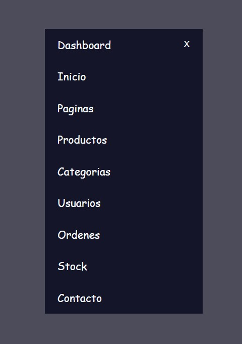

# Menu-Sidebar-Animado
un menu sidebar animado hecho en HTML, CSS y JS

  
    
  
    
  
  

## ¿Cuál es el fin de este proyecto?
Es una simple pagina hecha en HTML, CSS y JavaScript. 
Su objetivo no es mas que el aprendisaje y practica de herramientas que nos puede proporcionar JavaScript.

## ¿Puedo Probarlo en Linea? 
Si, Puedes probarlo en linea haciendo click [aqui](https://carlosorellana00.github.io/Menu-Sidebar-Animado/#)

## ¿Cómo puedo probarlo de manera local en mi equipo?
puede copiarse directamente desde git a traves de comando o descargarse en un archivo Zip, el proyecto no requiere de ningun servicio de servidor para correrse
de manera local en una computadora.

## Modo de uso
Es un modo muy sensillo de accion, el Menu es un Menu tipo Hamburguesa el como se comprime, solo debemos darle click a la "X" y veremos como se comprime

  

de la misma forma, al hacer click sobre el menu se volvera a abrir en forma completa.

  

## Agradecimientos y Referencias:

- [Autor Original -> Tuat Tran Anh](https://www.youtube.com/c/TuatTranAnh)
- [Video Original -> Sidebar Menu Expand from Hamburger Menu with Animation Using HTML CSS JavaScript](https://www.youtube.com/watch?v=1SuZOMMtzPs&t=1s)
- [Iconos -> Ioinicicons](https://ionic.io/ionicons)
